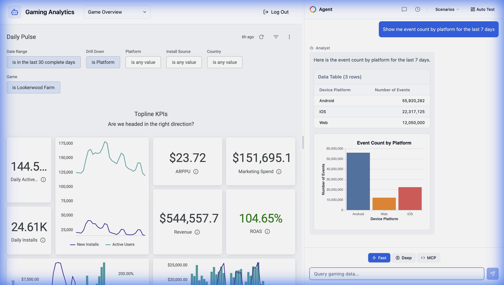

# Gaming Analytics Agent

A conversational analytics AI that enables users to query gaming data using natural language. Built with **Google Cloud's Gemini 3**, **Vertex AI**, and **Looker**.



## Features

- **Unified Analytics Agent**: Intelligently routes queries between "Fast" (API v2) and "Deep" analysis modes
- **Native Charting**: Renders **Vega-Lite** charts for fast responses and **Chart.js** for deep analysis
- **Looker Integration**: Dynamic SQL generation against LookML models
- **Live Thinking Process**: Transparent agent reasoning ("Analyzing...", "Querying Looker...")
- **Chat History**: Persistent conversations with full chart/table rendering

## Quick Start

### Prerequisites
- Python 3.11+
- Node.js 18+ & npm
- Google Cloud SDK (`gcloud`)
- Access to a GCP Project with Vertex AI enabled
- Looker instance with API credentials

### Local Development

1. **Clone & Setup Backend**
   ```bash
   git clone <repo-url>
   cd ca_api
   python3 -m venv venv
   source venv/bin/activate
   pip install -r requirements.txt
   ```

2. **Configure Environment**
   Create `.env` in the root directory:
   ```env
   PROJECT_ID=your-gcp-project-id
   LOCATION=global
   DATASET_NAME=events
   
   # Looker credentials
   LOOKER_CLIENT_ID=your_looker_client_id
   LOOKER_CLIENT_SECRET=your_looker_client_secret
   LOOKER_INSTANCE_URI=https://your-instance.looker.app
   LOOKML_MODEL=gaming
   EXPLORE=events
   ```

3. **Setup Frontend**
   ```bash
   cd frontend
   npm install
   cd ..
   ```

4. **Run Locally**
   ```bash
   # Terminal 1: Backend
   source venv/bin/activate
   python server.py
   
   # Terminal 2: Frontend
   cd frontend
   npm run dev
   ```
   Open http://localhost:5173

---

## Cloud Deployment

This project uses **Cloud Run** with **Identity-Aware Proxy (IAP)** to securely expose the application to internal users (e.g., `@google.com`).

### Deployment Script

The `scripts/deploy_private_demo.sh` script handles the entire deployment process:
1. Enables required IAP APIs.
2. Builds the frontend.
3. Deploys the container to Cloud Run.
4. Configures IAM policies for IAP access.

```bash
# Ensure you are authenticated with gcloud
gcloud auth login
gcloud config set project looker-private-demo

# Run the deployment script
./scripts/deploy_private_demo.sh
```

**Production URL**: https://analytics.embed-app-template-agent.dev/  
*(Login with your Google account)*

### Access Management

Access is restricted by default. Use the provided helper scripts to manage permissions if needed:

| Script | Description |
|--------|-------------|
| `./scripts/grant_access.sh email` | Grant Cloud Run invoker access |
| `./scripts/revoke_access.sh email` | Revoke access |
| `./scripts/list_access.sh` | List authorized users |

---

## Architecture

- **Backend**: Python Flask server (`server.py`) handling API requests and Looker SDK interaction.
- **AI Core**: `agent.py` orchestrates the Gemini 3 Pro/Flash models.
  - **Fast Agent**: Uses API v2 for rapid insights and Vega-Lite charts.
  - **Deep Agent**: Performs multi-step reasoning for complex questions.
- **Frontend**: React/Vite application with:
  - `VegaChartRenderer`: For fast mode visualizations.
  - `ChartRenderer`: For deep mode/Chart.js visualizations.
  - `LookerEmbedSdk`: For embedding dashboard visualizations.

## License

Internal use only.
